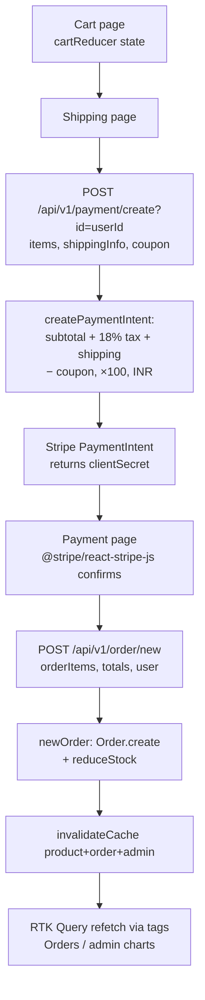

# MERN E-Commerce App

> Evidence (Step 0 — grounded in file contents read)
>
> - **Project type:** Full-stack **web app** = a REST **API** (backend) + a **SPA web app** (frontend), in one repo, two independent packages.
> - **Languages / frameworks / proof:**
>   - Backend — TypeScript on **Express 5** + **Mongoose 9** (ESM). Proven by `ecommerce-backend/package.json` (`express`, `mongoose`, `"type": "module"`) and `ecommerce-backend/src/app.ts` (`express()`, route mounting, `Stripe`, `cloudinary`, `NodeCache`).
>   - Frontend — TypeScript on **React 19** + **Vite 8**, **Redux Toolkit + RTK Query**, **react-router 7**. Proven by `ecommerce-frontend/package.json` and `ecommerce-frontend/src/App.tsx` / `src/redux/store.ts`.
> - **Entry points & what they call:**
>   - Backend entry: `ecommerce-backend/src/app.ts` → calls `connectDB()` (`utils/features.ts`), configures `cloudinary`/`stripe`/`myCache`, mounts `user|product|order|payment|dashboard` routers under `/api/v1`, ends with a 404 middleware + `errorMiddleware`.
>   - Frontend entry: `ecommerce-frontend/src/main.tsx` → `src/App.tsx`, which runs `useCheckAuthQuery()`, hydrates the user into `userReducer`, and declares all routes (public / logged-in / admin) via `react-router`.

A full-stack online store with a customer storefront and an admin dashboard. The repository is split into two independently installed/run TypeScript packages — an Express REST API and a React SPA — that communicate only over HTTP through `VITE_SERVER` + `/api/v1/<domain>/`.


## Overview

The **backend** (`ecommerce-backend/`) is a stateless Express 5 REST API persisting to MongoDB via Mongoose. It exposes five domains — `user`, `product`, `order`, `payment`, `dashboard` — each as a router under `/api/v1`. Read-heavy endpoints are cached in an in-process `node-cache` instance (`myCache`), and every mutation invalidates the affected cache keys so reads never serve stale data. Product images are uploaded through Multer (in-memory) and pushed to Cloudinary; checkout amounts are computed server-side and turned into Stripe PaymentIntents.

The **frontend** (`ecommerce-frontend/`) is a React 19 SPA built with Vite. All server data flows through **RTK Query** slices in `src/redux/api/` (one per backend domain), each with `tagTypes` so a mutation's `invalidatesTags` forces a refetch of matching queries. Purely client-side state — the cart and the authenticated user — lives in plain Redux slices in `src/redux/reducer/`. Authentication is handled with **Firebase** (e.g. Google sign-in on the client); the user record is mirrored into MongoDB and a JWT cookie session is issued by the backend.

The two ends are kept in sync by two parallel cache layers — backend `node-cache` and frontend RTK Query tags — and they share a single integration contract: the frontend appends `/api/v1/<domain>/` to `VITE_SERVER`, and the backend permits exactly one CORS origin (`CLIENT_URL`). A mismatch in either value silently breaks the link.

There is **no root `package.json`** — install and run each package separately.

## Architecture / How it works

### Components

| Component | File(s) | Responsibility |
| --- | --- | --- |
| API bootstrap | `ecommerce-backend/src/app.ts` | Loads env, connects DB, configures Cloudinary + Stripe (`apiVersion: "2026-05-27.dahlia"`), creates `myCache`, applies `json`/`cookieParser`/`morgan`/`cors`, mounts routers, 404 + error middleware, `listen()`. |
| Routers | `src/routes/*.route.ts` | Map HTTP verbs/paths to controllers; attach `adminOnly` / `verifyToken` / `mutliUpload` middleware. |
| Controllers | `src/controllers/*.ts` | Business logic; read from cache or DB, write to DB, invalidate cache, shape the JSON response. |
| Models | `src/models/*.model.ts` | Mongoose schemas: `User`, `Product`, `Order`, `Coupon`. |
| Cache + helpers | `src/utils/features.ts` | `connectDB`, `invalidateCache`, `reduceStock`, Cloudinary upload/delete, chart/inventory aggregation helpers. |
| Auth middleware | `src/middlewares/auth.ts`, `verifytoken.ts` | `adminOnly` (checks `?id=` → user role) and `verifyToken` (JWT cookie → `req.userId`). |
| Error plumbing | `src/middlewares/error.ts` | `TryCatch` wrapper + `errorMiddleware` → uniform `{ success:false, message }`. |
| Frontend store | `ecommerce-frontend/src/redux/store.ts` | Registers 4 RTK Query reducers+middleware and 2 plain reducers (`userReducer`, `cartReducer`). |
| API slices | `src/redux/api/*.ts` | `createApi` per domain; queries `providesTags`, mutations `invalidatesTags`. |
| App shell / routing | `src/App.tsx` | Auth bootstrap + public/protected/admin route tree (lazy-loaded). |

### Request lifecycle (backend)

Every request flows through the same pipeline; `TryCatch` guarantees any thrown error or rejected promise lands in `errorMiddleware`:

```
HTTP request
  → express.json + cookieParser + morgan + cors(origin: CLIENT_URL)
  → router match (/api/v1/<domain>/...)
  → [optional] adminOnly (?id=) / verifyToken (cookie) / mutliUpload
  → controller (TryCatch-wrapped)
       → myCache.has(key)? return cached JSON : query Mongo, cache, return
       → on write: persist → invalidateCache(...) → respond
  → errorMiddleware (only if next(err)) → { success:false, message }
```

### Caching contract (the core dependency)

The cache is the spine that links reads and writes. Read controllers store JSON strings under fixed keys; `invalidateCache` (`utils/features.ts`) deletes exactly those keys on mutation. **The producer of each key and its invalidator must agree, or the UI goes stale.**

| Cache key | Set by | Deleted by `invalidateCache({...})` |
| --- | --- | --- |
| `latest-products`, `categories`, `all-products` | product reads | `product: true` |
| `product-<id>` | single-product read | `product: true` + `productId` |
| `all-orders`, `my-orders-<userId>`, `order-<orderId>` | order reads | `order: true` (+ `userId`/`orderId`) |
| `admin-stats`, `admin-pie-charts`, `admin-bar-charts`, `admin-line-charts` | dashboard reads | `admin: true` |

Example dependency: `newOrder` (`order.controller.ts`) calls `invalidateCache({ product:true, order:true, admin:true, userId, productId: [...] })` — placing an order invalidates product caches (stock changed via `reduceStock`), order caches, **and** all admin chart caches at once.

### End-to-end checkout flow



Stage-by-stage data hand-off:
1. **Cart → Shipping:** cart items + address held in `cartReducer` (client state).
2. **Shipping → payment/create:** sends `{ items, shippingInfo, coupon }` with `?id=<userId>`. Backend recomputes `subtotal`, `tax = subtotal*0.18`, `shipping = subtotal>1000 ? 0 : 200`, subtracts the coupon amount, multiplies by 100 (paise), creates an INR PaymentIntent, returns `clientSecret`. **Totals are never trusted from the client here.**
3. **Payment:** the client confirms the PaymentIntent with Stripe.js using `clientSecret`.
4. **order/new:** persists the `Order`, then `reduceStock` decrements each product's `stock`, then `invalidateCache` clears product + order + admin keys.
5. **Refetch:** the next RTK Query read (orders list, dashboard charts) misses the now-empty cache and repopulates from Mongo.

## Features

### Product catalog with server-side caching

Lists latest products, all categories, and a paginated/filterable catalog, serving each from `myCache` when warm and from Mongo otherwise. Read endpoints are pure; freshness is maintained exclusively by `invalidateCache` on writes.

- **Mechanism:** `product.controller.ts` checks `myCache.has(key)` → returns parsed JSON, else queries `Product`, stores `JSON.stringify(...)`, responds. `getlatestProducts` sorts `createdAt: -1` limit 5; `getAllCategories` uses `Product.distinct("category")`. Pagination limit is `Number(process.env.PRODUCT_PER_PAGE) || 8`.
- **Inputs/outputs:** `GET /api/v1/product/latest|categories|all|filter` → `{ success, products|categories }`. Frontend consumes via `productAPI` (`useLatestProductsQuery`, `useCategoriesQuery`, `useSearchProductsQuery`, `useProductsFilterQuery`).
- **Example:**
  ```bash
  curl "$SERVER/api/v1/product/all?search=shirt&page=1&sort=asc&category=men"
  ```

### Admin product management (Multer → Cloudinary)

Admins create/update/delete products with image uploads. Photos are received in memory by Multer, base64-encoded, and uploaded to Cloudinary; only `{ public_id, url }` pairs are stored on the product — never local file paths.

- **Mechanism:** `mutliUpload` (`middlewares/multer.ts`) populates `req.files`; `uploadToCloudinary(files)` (`utils/features.ts`) maps each file through `cloudinary.uploader.upload(getBase64(file))` and returns `{ public_id, url }[]`. Deletes call `deleteFromCloudinary(publicIds)`. Routes are guarded by `adminOnly`.
- **Inputs/outputs:** `POST /api/v1/product/new?id=<adminId>` (multipart form) → `{ success, message }`; mirror `PUT`/`DELETE /api/v1/product/:id?id=<adminId>`.
- **Example (frontend):**
  ```ts
  const [newProduct] = useNewProductMutation();
  await newProduct({ id: adminId, formData }); // invalidatesTags: ["product"] → catalog refetches
  ```

### Stripe checkout with server-computed totals

Builds a Stripe PaymentIntent from a server-side price calculation so the client cannot tamper with the amount. Coupons are looked up live and subtracted before charging.

- **Mechanism:** `createPaymentIntent` (`payment.controller.ts`) fetches products by `_id $in`, computes subtotal, `tax = subtotal*0.18`, conditional shipping, subtracts `Coupon.amount`, `Math.floor`s the total, and calls `stripe.paymentIntents.create({ amount: total*100, currency: "inr", shipping })`. Stripe SDK is pinned to `apiVersion: "2026-05-27.dahlia"` in `app.ts`.
- **Inputs/outputs:** `POST /api/v1/payment/create?id=<userId>` body `{ items, shippingInfo, coupon? }` → `{ success, clientSecret }`.
- **Dependency:** feeds the **order creation** feature — `clientSecret` confirms the charge, after which `order/new` is called.

### Coupons / discounts

Admins create and delete fixed-amount coupons; the storefront validates a code and returns its discount before checkout.

- **Mechanism:** `Coupon` model stores `{ code, amount }`. `applyDiscount` (`GET /api/v1/payment/discount?coupon=<code>`) returns `{ discount }`; `newCoupon`/`allCoupons`/`deleteCoupon` are `adminOnly`. The same code is re-resolved server-side inside `createPaymentIntent` so the discount is enforced at charge time, not just displayed.
- **Inputs/outputs:** `GET .../payment/discount?coupon=SAVE200` → `{ success, discount: 200 }`.

### Orders with stock reduction & status lifecycle

Persists an order, atomically decrements product stock, and advances an order through `Processing → Shipped → Delivered`.

- **Mechanism:** `newOrder` validates required fields, `Order.create(...)`, then `reduceStock(orderItems)` loops each item and saves `product.stock -= quantity`. `processOrder` switches `status` forward one step. Both invalidate order/admin (and product, for new) caches. `myOrders` is keyed `my-orders-<userId>`; `allOrders` populates `user` name.
- **Inputs/outputs:** `POST /api/v1/order/new` → `{ success, message }`; `GET /api/v1/order/my?id=<userId>`; `PUT /api/v1/order/:id?id=<adminId>` advances status.
- **Example:**
  ```bash
  curl "$SERVER/api/v1/order/my?id=$USER_ID"   # → { success, orders: [...] }
  ```

### Admin dashboard analytics

Computes revenue, inventory distribution, and 6/12-month time series for charts, all behind `adminOnly` and cached under `admin-*` keys.

- **Mechanism:** `controllers/adminDashboard.ts` aggregates with helpers in `utils/features.ts`: `calculatePercentage(thisMonth,lastMonth)`, `getInventories({categories,productsCount})` (per-category share), and `getChartData({length,docArr,today,property})` (buckets docs into the last `length` months by `createdAt`, summing `property` or counting). Results cache as `admin-stats|pie|bar|line` and are wiped by any order mutation (`admin:true`).
- **Inputs/outputs:** `GET /api/v1/dashboard/{stats,pie,bar,line}?id=<adminId>` → domain JSON; frontend renders via `chart.js` + `react-chartjs-2`.

### Authentication: Firebase client + JWT cookie + role-based admin

Client identity is established with Firebase; the backend mirrors the user into Mongo, issues a JWT cookie session, and gates admin actions by role.

- **Mechanism:** `newUser`/`SignInUser` (`user.controller.ts`) hash passwords with `bcryptjs` and call `generateTokenAndSetCookie(res, user._id)` (sets `token` cookie). `verifyToken` (`verifytoken.ts`) reads `req.cookies.token`, verifies with `JWT_SECRET`, sets `req.userId`; `checkAuth` returns the current user. **Admin endpoints** use a *separate* scheme: `adminOnly` (`auth.ts`) reads `req.query.id`, loads the user, and requires `role === "admin"`. On the client, `App.tsx` calls `useCheckAuthQuery()` and `ProtectedRoute` gates `/login`, logged-in routes, and `admin` routes (`user?.role === "admin"`).
- **Inputs/outputs:** `GET /api/v1/user/check-auth` (cookie) → `{ success, user }`; `POST /api/v1/user/signin` → sets cookie + `{ user }`.

> Note: two auth schemes coexist — cookie-JWT (`verifyToken`) for the current user and `?id=`-query role checks (`adminOnly`) for admin routes. <!-- TODO: confirm this split is intentional vs. consolidating admin checks onto the JWT cookie -->

### Frontend data layer: RTK Query tag invalidation

A typed client cache keyed by domain. Queries declare `providesTags`; mutations declare `invalidatesTags`, so a successful write auto-refetches dependent reads without manual wiring.

- **Mechanism:** each slice in `src/redux/api/` is `createApi({ baseQuery: fetchBaseQuery({ baseUrl: \`${VITE_SERVER}/api/v1/<domain>/\` }), tagTypes, endpoints })`. `store.ts` registers every slice's `reducer` and `middleware`. `userReducer`/`cartReducer` hold non-server state.
- **Example:** `productAPI` queries all set `providesTags:["product"]`; `newProduct`/`updateProduct`/`deleteProduct` set `invalidatesTags:["product"]` → the catalog refetches after any admin edit. This mirrors the backend's `invalidateCache({product:true})`.

## Installation

Prerequisites: Node.js (developed with v24 <!-- TODO: confirm minimum supported Node version -->), a MongoDB URI, and Stripe / Cloudinary / Firebase credentials.

```bash
git clone <repo-url> && cd MERN-Ecommerce-App

# Backend
cd ecommerce-backend && npm install
# Frontend
cd ../ecommerce-frontend && npm install
```

The backend compiles TypeScript to `dist/` and runs the compiled output (no `ts-node`). For local dev run two terminals:

```bash
# in ecommerce-backend/
npm run watch    # tsc -w  (src → dist on change)
npm run dev      # nodemon dist/app.js (restart on recompile)
# other: npm run build (one-off tsc / typecheck), npm start (run dist/app.js)
```

```bash
# in ecommerce-frontend/
npm run dev      # Vite dev server
npm run build    # tsc && vite build
npm run preview  # serve production build
npm run lint     # ESLint, fails on any warning (--max-warnings 0)
```

## Usage

1. Fill both `.env` files (below), start MongoDB.
2. Backend: `npm run watch` + `npm run dev`. Frontend: `npm run dev`.
3. Open the Vite URL and sign in. Admin routes require a user whose `role` is `admin`. <!-- TODO: confirm how a user is promoted to admin (e.g. setting role:"admin" directly in MongoDB) -->

**Scenario — fetch latest products (input → output):**
```bash
curl "$SERVER/api/v1/product/latest"
# → { "success": true, "products": [ { "_id": "...", "name": "...", "price": 999, "photos": [{ "public_id": "...", "url": "https://res.cloudinary.com/..." }], "stock": 12, "category": "..." } ] }
```

**Scenario — create a PaymentIntent (input → output):**
```bash
curl -X POST "$SERVER/api/v1/payment/create?id=$USER_ID" \
  -H "Content-Type: application/json" \
  -d '{"items":[{"productId":"<id>","quantity":2}],"shippingInfo":{"address":"...","city":"...","state":"...","country":"IN","pinCode":560001},"coupon":"SAVE200"}'
# → { "success": true, "clientSecret": "pi_..._secret_..." }
```

**Scenario — advance an order's status (admin):**
```bash
curl -X PUT "$SERVER/api/v1/order/<orderId>?id=$ADMIN_ID"
# → { "success": true, "message": "Order Processed Successfully" }   (Processing → Shipped → Delivered)
```

## Configuration

### Backend — `ecommerce-backend/.env`

| Variable | Type | Default | Effect |
| --- | --- | --- | --- |
| `PORT` | number | `4000` | Port the API listens on (`app.ts`). |
| `NODE_ENV` | string | — | Environment flag. |
| `MONGO_URI` | string | — | MongoDB connection string; DB name pinned to `Ecomerce24` in `connectDB`. |
| `CLIENT_URL` | string | `""` | **Single** allowed CORS origin (credentialed). Must equal the frontend origin. |
| `JWT_SECRET` | string | — | Signs/verifies the `token` auth cookie. |
| `STRIPE_SECRET_KEY` | string | `""` | Server-side Stripe key for PaymentIntents. |
| `CLOUD_NAME` | string | — | Cloudinary cloud name. |
| `CLOUD_API_KEY` | string | — | Cloudinary API key. |
| `CLOUD_API_SECRET` | string | — | Cloudinary API secret. |
| `PRODUCT_PER_PAGE` | number | `8` | Pagination size in `product.controller.ts`. |

### Frontend — `ecommerce-frontend/.env` (Vite exposes only `VITE_`-prefixed vars)

| Variable | Type | Default | Effect |
| --- | --- | --- | --- |
| `VITE_SERVER` | string | — | Backend origin; slices append `/api/v1/<domain>/`. |
| `VITE_STRIPE_KEY` | string | — | Stripe publishable key (`pk_test_…`/`pk_live_…`). |
| `VITE_FIREBASE_KEY` | string | — | Firebase web API key. |
| `VITE_AUTH_DOMAIN` | string | — | Firebase auth domain. |
| `VITE_PROJECT_ID` | string | — | Firebase project ID. |
| `VITE_STORAGE_BUCKET` | string | — | Firebase storage bucket. |
| `VITE_MESSAGING_SENDER_ID` | string | — | Firebase messaging sender ID. |
| `VITE_APP_ID` | string | — | Firebase app ID. |

## Project structure

```
.
├── ecommerce-backend/
│   ├── src/
│   │   ├── app.ts                    # Entry: env, DB, Stripe, Cloudinary, cache, routers
│   │   ├── routes/                   # *.route.ts → mounted under /api/v1/<domain>
│   │   ├── controllers/              # user, product, order, payment, adminDashboard logic
│   │   ├── models/                   # Mongoose: user, product, order, coupon
│   │   ├── middlewares/              # auth (adminOnly), verifytoken (JWT), error (TryCatch), multer
│   │   ├── utils/
│   │   │   ├── features.ts           # connectDB, invalidateCache, reduceStock, Cloudinary, chart helpers
│   │   │   ├── utility-class.ts      # ErrorHandler
│   │   │   └── generateTokenAndSetCookie.ts
│   │   └── types/types.ts            # Shared request/query types
│   └── package.json                  # scripts: watch / dev / build / start
└── ecommerce-frontend/
    ├── src/
    │   ├── main.tsx                   # React root
    │   ├── App.tsx                    # Auth bootstrap + route tree (public/protected/admin)
    │   ├── redux/
    │   │   ├── store.ts               # Registers RTK Query slices + plain reducers
    │   │   ├── api/                   # userApi, productApi, orderApi, dashboardApi
    │   │   └── reducer/               # cartReducer, userReducer (client state)
    │   ├── pages/                     # storefront pages + admin/ (dashboard, charts, apps, management)
    │   ├── components/                # shared UI + shadcn/ui primitives
    │   └── firebase.ts                # Firebase client config
    ├── vercel.json                    # SPA rewrite (all paths → /)
    └── package.json                  # scripts: dev / build / preview / lint
```

## Contributing

Open an issue to discuss a change, then submit a PR. Run each package's gates first: backend `npm run build`; frontend `npm run lint` && `npm run build`. <!-- TODO: add CONTRIBUTING.md if a formal process is wanted -->

## Getting help

Use the repository issue tracker for bugs and questions.

## License

The backend `package.json` declares the **ISC** license. <!-- TODO: add a root LICENSE file — none currently exists, and the frontend package declares no license -->
